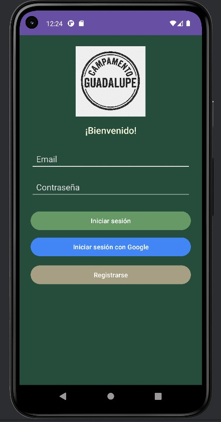
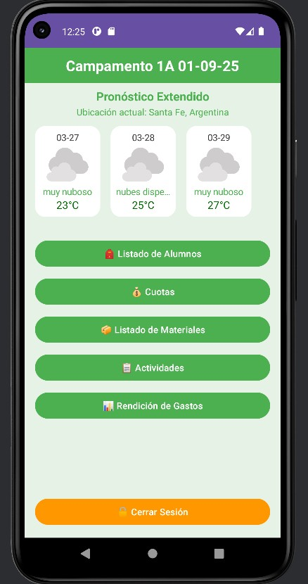
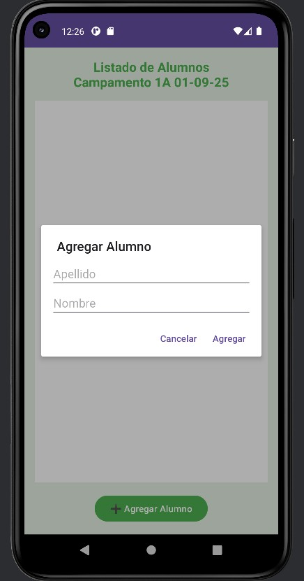
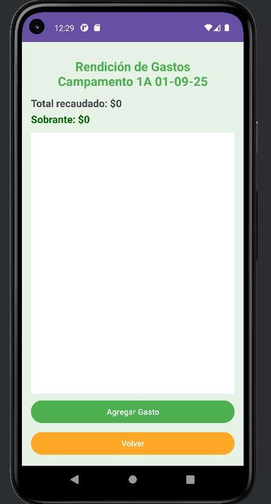

# Campamento Guadalupe App

## 💡 Proyecto aplicado en contexto real
Aplicación Android desarrollada para la gestión de actividades en un campamento educativo de todos los niveles. En colaboracion con Colegio Nuestra Señora de Guadalupe (Patricio Cullen 7397, Santa Fe, Argentina.).

## 🚀 Descripción
Esta app fue creada como solución práctica para organizar grupos, materiales y actividades dentro de un campamento, facilitando la gestión diaria.

## ⚙️ Funcionalidades
- Gestión de grupos
- Registro de alumnos
- Carga de materiales
- Actividades con fotos
- Navegación simple para uso en campo

## 🛠️ Tecnologías
- Java (Android)
- Android Studio
- Almacenamiento local

## 🎯 Objetivo
Digitalizar y simplificar la organización de actividades en campamentos, reemplazando el uso de papel.

## 📌 Contexto real
Aplicación desarrollada para uso real en un entorno de campamento religioso.

## 💡 Valor del proyecto
Este proyecto demuestra capacidad para:
- Crear soluciones a medida
- Diseñar apps funcionales desde cero
- Adaptar tecnología a necesidades reales

## 👨‍💻 Autor
Alejandro García
